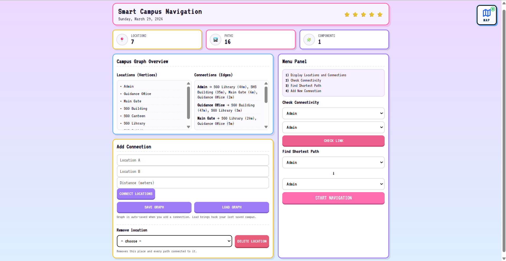
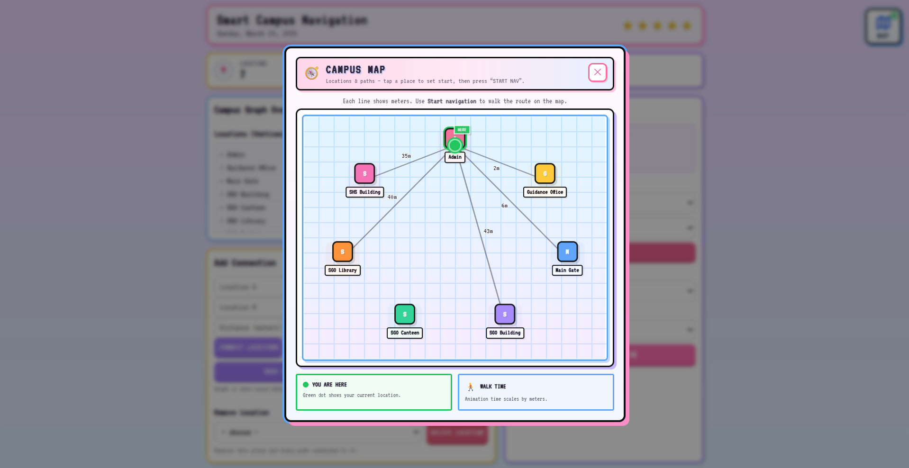
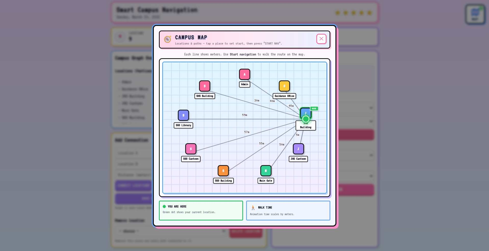
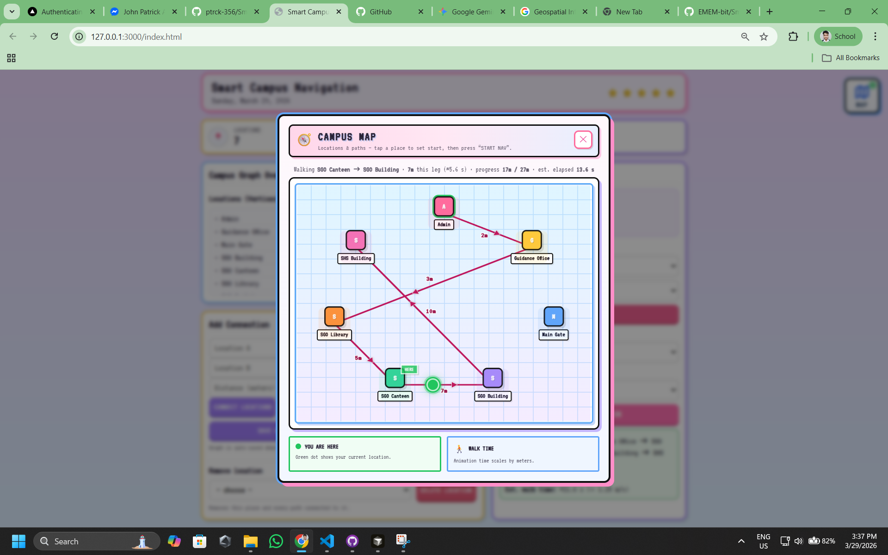

# MIDTERM EXAM OVERVIEW

# Smart Campus Nav

A simple, "kawaii-style" dashboard for managing and visualizing **smart campus navigation**. This tool uses Dijkstra’s algorithm to find the shortest walking paths between buildings and simulates the trip on a dynamic mini-map.

---

## Features

- **Pathfinding:** Uses Dijkstra’s Algorithm to calculate the fastest route between any two points.

- **Interactive Mini-Map:** An SVG-based map that auto-layouts your locations in a clean, circular view.

- **Walking Simulation:** Watch a "player" dot travel the route in real-time based on actual walking speeds (1.25m/s).

- **Graph Editor:** Add, delete, or modify building connections and distances on the fly.
- **Persistence:** Saves your custom campus layout to localStorage so it's still there when you refresh.

## How it Works
The project is split into two main logic parts:
1. **The Engine (script.js):** This handles the heavy lifting. It stores the campus as an adjacency list and runs a Breadth-First Search (BFS) to check connectivity and Dijkstra's for the shortest path.
2. **The Visualizer (minimap.js):** This takes the raw data and uses basic trigonometry (sin and cos) to plot the buildings on an SVG canvas. It also handles the CSS transitions for the "walking" animation.

## Design
The UI is inspired by **Neubrutalism:** think thick borders, hard shadows, and high-contrast pastel colors. The font used is VT323 to give it a retro, terminal-like feel.

## Stack
- HTML5 / CSS3 (CSS Grid & Flexbox)
- Vanilla JavaScript (No frameworks used)
- SVG for the mapping system

---

## Quick Start
1. Open index.html in any modern browser.
2. Use the Editor to add a few buildings and distances (e.g., "Library" to "Cafeteria" = 50m).
3. Select your start and end points in the Navigation Tool.
4. Hit Go and open the Mini-Map to see the simulation.

---

## Group Members
1. Iyas, Marjorie I.
2. Labordo, Christopher John O.
3. Pardiñas, Ibrahim Ronald A.